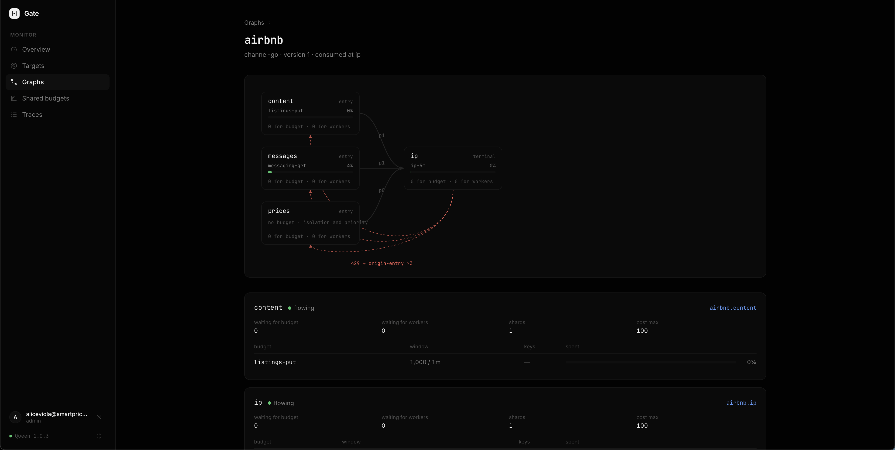

# Gate

An egress rate limiter built on [QueenMQ](https://queenmq.com). You declare what a
vendor lets you do; Gate decides what leaves and when, and holds the work that does
not fit until it does.

A limit is rarely one number. A portal gives you a per-endpoint rate, a per-account
rate, a per-listing rate, and a ceiling on the egress IP that counts all of them at
once. The interesting question is not how to count, it is how those limits
**compose**. That is what a graph is for, and most of this document is about it.

<a href="assets/dashboard.png"></a>

---

## What it is made of

Three queen primitives, used directly. There is nothing else in the data plane.

| | |
|---|---|
| **The limiter** | `kv.incr(key, delta, { max, ttl })`. The call that would break the ceiling **does not apply and returns the current value**, so `applied` **is** the admission decision — one round trip, no CAS loop, no read-then-write race. The TTL is create-only, so the window rotates by itself. |
| **The relay** | One queen transaction: `ack(the source messages) + push(the next stage's queues)`, atomic. One source partition per claim, and every push goes to the **same-named partition** on the destination. |
| **The scheduler** | The broker's wildcard long-poll. It picks candidate partitions in randomised order under `FOR UPDATE SKIP LOCKED`, so N workers spread across partitions with no coordination — and an idle stage is a parked poll holding no database connection. |

What runs is one consumer per hop of one path. No pinned runners, no depth probes,
no rotation cursor, no meter loop, no state document.

**Why it is shaped this way**, in three measurements:

* **Prod, one hour.** The previous design made ~275,000 "is there work?" calls to
  move messages **963** times — 285 polls per relay. Nothing was broken; that is
  what a polling data plane costs while idle, and idle is most of the time. An
  idle graph here costs `stages × workers × replicas ÷ poll_timeout` pops a
  second and nothing else — no depth probe, no state read, no meter tick. And
  the workers come from the BUDGET, not from the partition count: a limiter
  never needs to drain faster than it admits, so a stage whose ceiling is 200
  items a second gets one lane however many partitions the ordering is spread
  over. The three graphs we run — sixteen stages, caps from 1.7 to 400 items a
  second — are **sixteen parked polls per replica, about 1,900 an hour**,
  against v1's 275,000. Three
  knobs move it further: `GATE_POLL_TIMEOUT_SECONDS` is paid in shutdown
  latency, `GATE_LANE_CAPACITY` in how much of a burst one lane absorbs, and
  `GATE_STAGE_CONCURRENCY` overrides the derivation outright.
* **Bench, 32-core VM.** The old counter-funnel relay topped out at **2.8k items/s**
  with tuple lock waits at 96–100%, because every admission was a write transaction
  on one partition row. A `txnload` with **disjoint lanes** — the shape this design
  adopts — did **23–34k items/s** on the same machine. Draining a pre-filled backlog
  through this one, on a laptop sharing its cores with the broker and the driver:
  102 items/s at batch 1, 3,041 at batch 25, **13,070 at batch 200** and 39,798 at
  batch 500, with `forwarded / commits` tracking the batch to within 11%.
* **`kv.incr` on one key does 33k/s**, and the budget is charged once per **batch**.
  At batch 200 and 34k items/s the counter sees 170 incr/s. That is the sentence
  that makes one shared key acceptable where one shared partition was not — and
  eight stages sharing one counter were measured moving 19–39k items/s while that
  counter saw 103–253 incr/s, which is the same sentence with the numbers in it.

---

## Run it locally

Gate needs a QueenMQ broker and, optionally, a PostgreSQL for history.

```bash
docker run -d --name queen-pg -e POSTGRES_PASSWORD=postgres -p 5434:5432 postgres:18
docker run -d --name queen --link queen-pg \
  -e PG_HOST=queen-pg -e PG_PASSWORD=postgres -e QUEEN_KV_ENABLED=true \
  -p 6632:6632 ghcr.io/queen-mq/queen:latest
```

`QUEEN_KV_ENABLED` is not optional: every declaration and **every counter** lives in
`queen.kv`.

Then Gate itself:

```bash
docker run -d --name gate -p 8788:8788 -p 8790:8790 \
  -e QUEEN_URL=http://host.docker.internal:6632 \
  -e GATE_BIND=0.0.0.0:8788 \
  -e GATE_PUBLIC_BIND=0.0.0.0:8790 \
  -e GATE_DEV_EMAIL=you@example.com \
  -e GATE_ADMIN_EMAILS=you@example.com \
  -e PG_HOST=host.docker.internal -e PG_PORT=5434 \
  -e PG_USER=postgres -e PG_PASSWORD=postgres -e PG_DATABASE=postgres \
  ghcr.io/queen-mq/gate:latest
```

The console is on <http://localhost:8790>, the API on `:8788`.

**Two ports, on purpose.** `GATE_BIND` is the plane your applications call and has no
authentication: the assumption is that only your network can reach it.
`GATE_PUBLIC_BIND` is the console and requires a Google session on every route. Do not
expose the first one.

`GATE_DEV_EMAIL` is the local bypass: it skips sign-in and treats every request as
that identity. Gate refuses to boot with it set on an `https` public URL.

Without `PG_HOST` Gate still limits exactly as well; it just cannot answer anything
about yesterday. It creates schema `gate` and its tables itself at boot.

---

## Concepts

**Graph** is the only object. A node is a place a limit applies; a path is the
sequence of nodes a message visits. A standalone target is a one-node graph, declared
through the same `/v1/apps/{app}/targets/{name}` route it always was.

**Application** is who owns the graph. Applications never share a ceiling and never
see each other's queues. Identity is the pair `application/graph`, so two teams may
both have something they call `airbnb`.

**Node** holds budgets. Its counter is one Postgres row per budget, in `queen.kv`.

**Path** is a sequence of nodes, and it names the consumer groups. Two paths crossing
one node is **pub-sub**: each path's group receives every message, which is intended
and composes with fan-out.

**Budget** is `count` per `timeMs`, subdivided for smoothing. It is enforced as a
kv counter with a create-only TTL.

**Ingress** is how work enters a node. It is either a queue Gate creates and owns, or
**a queue your application already owns** — in which case your producers push with
their normal SDK and Gate can be down without blocking your ingest.

**Egress** is the queue your workers pop, with their own SDK. Gate does not mediate
the pop, does not hand out leases and never sees the outcome.

---

## The shape of a limit

```jsonc
{
  "application": "channel",
  "graph": "airbnb",
  "version": 3,

  "nodes": {
    "prices": {
      "ingress": true,                              // a queue Gate owns
      "cost": { "path": "payload.rooms", "default": 1, "max": 50 },
      "budgets": [
        { "id": "prices-1s", "count": 100, "timeMs": 1000,
          "confidence": "documented", "source": "https://…", "asOf": "2026-08-01" }
      ]
    },
    "messages": {
      "ingress": { "queue": "channel.airbnb.messages.in", "http": false },  // yours
      "cost": { "path": "payload.rooms", "default": 1, "max": 10 },
      "budgets": [ { "id": "messages-1m", "count": 600, "timeMs": 60000,
                     "subWindows": 60 } ]
    },
    "photos": {
      "ingress": true,
      "cost": { "path": "payload.rooms", "default": 1, "max": 5 },
      "budgets": [
        { "id": "photos-1m",   "count": 300, "timeMs": 60000, "subWindows": 60 },
        { "id": "per-listing", "count": 100, "timeMs": 604800000, "subWindows": 1,
          "scopeBy": "payload.listingId", "whenOp": ["photo.delete"] }
      ]
    },
    "ip": {
      "cost": { "path": "payload.rooms", "default": 1, "max": 50 },
      "budgets": [
        { "id": "ip-10s", "count": 1500, "timeMs": 10000, "subWindows": 10,
          "sharedKey": "egress-ip" }
      ],
      "egress": { "queue": "channel.airbnb.out", "group": "channel-workers" }
    },
    "audit": {
      "budgets": [ { "id": "audit-1s", "count": 2000, "timeMs": 1000 } ],
      "egress": "channel.airbnb.audit"
    }
  },

  "paths": [
    { "name": "prices",   "priority": 0, "share": 1.0,  "nodes": ["prices",   "ip"] },
    { "name": "messages", "priority": 1, "share": 0.75, "nodes": ["messages", "ip"] },
    { "name": "photos",   "priority": 2, "share": 0.5,  "nodes": ["photos", ["ip","audit"]] }
  ]
}
```

Read it back:

* `prices` may drive the shared `ip` counter to its ceiling. `photos` refuses itself
  at half of it. **The top half is a reserve only `prices` can reach**, held by the
  same row lock that does the counting.
* `ip-10s` is subdivided into ten one-second windows of 150, so a burst cannot take
  the whole ten-second allowance in the first 200ms.
* `per-listing` is 100 photo deletions per listing per week — 200,000 Postgres rows
  with a seven-day TTL, and no Gate machinery at all.
* `photos` fans out to `ip` **and** `audit`: one transaction, two pushes, two derived
  transaction ids. The declare says so, loudly.

The smallest useful declaration is one node:

```json
{
  "version": 1,
  "nodes": {
    "providerx": {
      "ingress": { "queue": "rrl.ingress.price-airbnb" },
      "budgets": [ { "id": "providerx", "count": 100, "timeMs": 1000 } ],
      "egress": "rrl.egress.price-airbnb"
    }
  },
  "paths": [ { "name": "main", "nodes": ["providerx"] } ]
}
```

### Budgets

`count` per `timeMs`, and nothing else. There is no alignment: **kv owns a fixed
window and nothing else.**

**Smoothing is subdivision.** A window longer than a second is enforced as `count/N`
per `timeMs/N`, so a burst cannot take a ten-second allowance in the first 200ms.
`subWindows` is the knob; it defaults to aiming at a one-second sub-window.

**The boundary.** This is a fixed window whose start is the first admitted request
after the previous one expired. A sliding observer can see up to **2 × count_sub**
across one boundary — with `subWindows: 10` that is 2/10 of the declared count, not
twice it. The declare response says the number for your budget.

**A sub-second window cannot be expressed.** A kv TTL is whole seconds, so `timeMs`
below 1000 is enforced as `count` per **second** — tighter than declared, never
looser, but slower. The declare warns and names both numbers.

`scopeBy` is one counter per distinct value of a payload path. `sharedKey` is one
counter across every node and graph of the application that names it. `whenOp`
charges only for a matching `payload.op`.

### Cost

```jsonc
"cost": 1
"cost": { "path": "payload.msgCount", "default": 1, "max": 100 }
```

**Costs are integers**, because `kv.incr`'s delta is an `i64` on this wire. A
fractional weight is expressed by counting tenths and multiplying the budget by ten.
An item declaring more than `max` is refused at the door and dead-lettered if it
arrives on a queue Gate does not own — an item that cannot fit a window can never be
admitted, and it would otherwise park the head of its partition for ever without
reaching a DLQ.

### Priority is capacity, not queue position

A path's `share` is a **ceiling on the node's one counter**:

```
path P's incr at node N uses  max = round(count_sub(N) × share(P))
```

so the headroom above every lower ceiling is an exact, atomic reserve — with no
scheduler, no barrier, no depth probe and no leg ordering anywhere in the codebase.
The shares do not have to sum to 1 and normally will not; they overlap on purpose,
and the total is still bounded because there is one counter.

Where a node is crossed by exactly one path there is nothing to share, so that path
gets the whole ceiling whatever it declared. The declare response echoes the
resolved ceilings per node, per path.

**What this gives up:** strict priority. A low-priority message already sitting in an
interior queue is still ahead of a high-priority one in that partition. What it buys
is that the reserve is always there — which is the property the feature was for, and
which the previous design could not deliver: its lanes each held their own copy of
the counter, and two lanes both told "you may use the ceiling" genuinely spent it
twice (measured at 93/s against a declared 50/s).

---

## The life of one push

```
your producer  ──►  ingress queue        (your SDK, or Gate's HTTP front door)
                        │
              stage: wildcard long-poll, batch 200, one source partition
                        │
                    kv.incr(budget key, batch cost, {max: your share, ttl: sub-window})
                        │
             applied ───┴─── refused ──► admit the PREFIX that fits, or
                │                        park in-handler, or release the claim
                ▼
        ONE transaction: ack(the batch) + push(next hop, same partition)
                        │
                        ▼
                  egress queue           ──►  your workers, your SDK, your ack
```

**A denial charges nothing.** The whole batch is charged in one call; if any counter
refuses, what applied is refunded and the prefix that fits is charged instead.
Prefix, not subset: order inside a partition is the guarantee the whole design rests
on.

**Waiting is not failing.** When nothing fits, the handler parks in-handler holding
its claim for as long as it can afford to (`GATE_MAX_PARK_MS`), and returns without
acking when it cannot — and queen charges **no retry budget on lease expiry**, so paced
work is never dead-lettered for waiting. An explicit failed ack is reserved for real
poison, which is why Gate has a working DLQ again.

Parking is preferred to releasing for a measured reason: a claim settled IN FULL
re-arms its partition in about 7ms, but one that is released is not offered again for
about a minute — so the only time it is worth releasing is when the wait is longer
than the claim can be held.

---

## What a declare refuses

Every rule turns a silent runtime failure into a rejected `PUT`, and each names the
number, the consequence and the fix. The rule names are API.

**Shape** — `application`, `graph-name`, `node-name`, `path-name`, `nodes`, `paths`,
`path-node`, `path-length`, `acyclic`, `path-entry`, `path-terminal`, `node-orphan`,
`fanout-branch`, `fanout-terminal`.

**Budgets** — `node-budget`, `node-unscoped-budget`, `budget-count`, `budget-window`,
`budget-unique`, `subwindow-fits`, `subwindow-range`, `cost-fits`, `cost-max`,
`cost-integer`, `cost-path`, `scope-path`, `shared-conflict`, `whenop-empty`,
`provenance`.

**Shares** — `share-range`, `share-top`, `share-order`, `share-rounds-out`.

**Ownership** — `ingress-owner`.

And the warnings, which are trades rather than mistakes: `window-sub-second`,
`subwindow-rounding`, `window-boundary`, `fanout-multiplies`, `ingress-queue`,
`ingress-retention`, `egress-owner`, `single-partition`.

---

## The API

### Declare

```http
PUT /v1/apps/{app}/graphs/{name}
PUT /v1/apps/{app}/targets/{name}      # sugar: a one-node graph
PUT /v1/apps/{app}/targets             # the whole set, and reap what is missing
GET|DELETE the same paths
```

The whole document, every time. A `200` means validated, provisioned **and** stored:
a store that will not take it answers `502` saying the graph is running the new
document, is not durable, and will be put back by the next reconcile pass.

The response carries the compiled plan — every queue, every consumer group, every kv
key, and the per-path ceiling on every budget — so you never have to reconstruct it.

### Push

Optional. Where a node names a queue **you** own, your producers push to it with
their own SDK and this route is off by default.

```http
POST /v1/apps/{app}/graphs/{graph}/nodes/{node}/push
{ "op": "calendar.push", "partition": "conn-7", "txn": "listing-42:availability",
  "payload": { "rooms": 3 } }
```

`partition` is **yours**, and it is passed through unchanged at every hop: it is what
keeps a connection's items in order end to end. A push that names none is spread
across the ingress queue's declared width, because nothing about it has an order to
keep. `txn` is the coalescing lever — two pushes with the same one inside the dedup
window collapse to one, so lag compresses the backlog instead of growing it. The door
refuses a cost above `cost.max` (422), a missing `scopeBy` value (422), and answers
**429 with a Retry-After** when the node is already at its ceiling.

v1's body put the cost at the top level (`"cost": 3`) rather than in the payload. It
is still read there, and written to the node's own `cost.path` on the way through: the
field decides what an item spends, and dropping it would charge every v1 caller's item
the declared default instead of what they asked for.

### Consume

Your own SDK, against the egress queue:

```js
await queen.queue('channel.airbnb.out').group('channel-workers')
  .consume(async (msg) => { /* … */ })
```

`GET .../next` and `POST /v1/leases/*` answer **410 Gone**, naming the queue.

### Back off

```http
POST /v1/apps/{app}/graphs/{graph}/nodes/{node}/backoff
{ "retryAfterSeconds": 30, "refundCost": 1 }
```

The vendor said 429. Gate **spends the node's window**: the counter is written to its
ceiling with a TTL of your `Retry-After`, so every path stops through the ordinary
refusal path — no new code path, no flag for the hot loop to check, nothing to forget
to clear — and every parked consumer's wait **is** your deadline. `DELETE` the same
path lifts it early.

### And the one item

```http
POST /v1/apps/{app}/graphs/{graph}/reenter
{ "payload": { ... }, "txn": "the id it arrived with", "partition": "conn-42" }
```

The backoff above is the AGGREGATE half of what the old `breach` rules did; this is
the per-item half. The item goes back to the ingress queue of the **first node of its
own path** — the door it came in at — so it re-pays every budget on that path rather
than skipping the ones upstream of where it failed. The attempt rides in the
transaction id (`derive(txn, "r{n}")`), so reporting one item twice collapses on the
broker's dedup instead of re-entering twice, and nothing here keeps a table of what
has been retried. It is refused past the graph's `maxAttempts` (default 3), counted in
`_gate.attempt`, which every hop carries forward.

What did not survive is the TRIGGER. v1 watched the Gate-mediated ack and re-entered
by itself; your consumers pop the egress queue with their own SDK now and Gate never
sees the outcome, so re-entry is something you ask for.

### When

```http
GET /v1/apps/{app}/graphs/{graph}/nodes/{node}/eta?path=prices
```

Two backlogs, kept apart because they have different owners:
`waitingForBudget` is Gate holding work back on purpose, and `waitingForWorkers` is
your own consumers not keeping up. The answer is a **bound**, never a promise, and
`assumes` names every caveat that actually applies.

---

## Migrating from v1

The endpoint shapes do not move. A v1 document is accepted, mapped, and answered
**200 with warnings naming every field that was mapped or ignored**.

| v1 | v2 |
|---|---|
| `cap` / `periodSeconds` | `count` / `timeMs` |
| `alignment: rolling` | `subWindows`, which bounds the boundary exposure to 2 × count/N |
| `alignment: calendar` | `subWindows: 1` — no longer wall-clock aligned |
| `scope: [dim]` | `scopeBy: "payload.{dim}"` |
| `maxKeys`, `shardBy`, `shards` | no-ops: cardinality is rows with a TTL |
| `store: kv` | `sharedKey` |
| `lanes[]` | one **path** each — but read the warning: lanes DIVIDED a ceiling and were addressed by the push URL, and two paths on one ingress node each receive **every** message |
| `edges[]` | `paths` |
| `consume[]` | `egress`, keeping the queue name your workers already pop |
| `pacing`, `admitted.partitionBy` | no-ops |
| `breach[]` | `maxAttempts`, with a warning: the bound survives, the trigger moved to `POST .../reenter` |

Terminal queue names are stable across the migration by construction. For a change
that re-founds a counter or strands a queue, the documented procedure is unchanged:
stop pushing, wait for `waitingForBudget` to reach zero on every node, `PUT` with a
higher `version`, resume.

---

## Operating it

| knob | default | what it is |
|---|---|---|
| `QUEEN_URL` | `http://localhost:6632` | the broker |
| `GATE_BIND` | `0.0.0.0:8788` | the internal API |
| `GATE_PUBLIC_BIND` | — | the console, sign-in required |
| `GATE_KV_NAMESPACE` | `gate` | where the counters and documents live |
| `GATE_STAGE_BATCH` | 200 | the per-claim batch; also the divisor on the counter's traffic |
| `GATE_STAGE_CONCURRENCY` | derived, see `GATE_LANE_CAPACITY` | workers per stage, overriding the derivation |
| `GATE_LANE_CAPACITY` | 1000 | what one lane drains, items/s. `workers = clamp(ceil(cap_rate / this), 1, partitions)` |
| `GATE_LEASE_SECONDS` | 30 | a **work** lease, renewed while a handler runs |
| `GATE_POLL_TIMEOUT_SECONDS` | 30 | the parked long-poll window |
| `GATE_MAX_PARK_MS` | 30000 | how long a handler may hold its claim waiting for a window; past it, it releases |
| `GATE_RECONCILE_SECONDS` | 15 | how often a replica re-reads the store |
| `PG_HOST` … | — | optional history |

**Two replicas are safe.** Declarations live in `queen.kv` and every replica
reconciles against them on a timer; counters are one row each, so N replicas spend
one budget.

### Attestation

There is no certificate mechanism and there never was: the word was a metaphor for
the freshness of an admission decision as it crossed an edge. What must be said out
loud, because v2 **names** the egress queue in the declaration where v1 relied on its
queues being undiscoverable:

> **Write access to an interior or egress queue is admission bypass — the same trust
> model as any queen queue. Gate paces what flows through it; it does not defend a
> queue from a writer who already has the credentials.**

The `_gate` stamp Gate puts on a routed payload is unsigned and unverified. It is
trusted because Gate writes it server-side, and a producer pushing to a queue you own
can write one — Gate overwrites it on the first hop.

### Observability

The hot path writes **nothing**: one KV batch and one transaction, and that is the
whole budget. Per stage there are counters (`popped`, `admitted`, `deferred`,
`parked`, `released`, `forwarded`, `commits`, `duplicates`, `foreign`,
`deadlettered`), and `forwarded / commits` is the number that explains a stage's
throughput.

Denials are kept in a bounded in-process ring. **Admissions are counted, never
traced** — which is a real reduction against v1, where a trace row rode in the same
transaction as the ack. There is no ack now, so there is no atomicity to inherit and
no measured-versus-estimated cost to compare.

Rollups and charts are **opt-in per graph**:

```json
"counters": { "windowSeconds": 60 }
```

Off by default, on purpose: observability is a thing you switch on, not a thing that
runs whether or not anyone is looking.

---

## Build

```bash
cd ui && npm ci && npm run build && cd ..   # the console is compiled into the binary
cargo build --release --workspace
```

## Test

```bash
cargo test --workspace                       # units; the live suite reports as ignored
GATE_TEST_QUEEN_URL=http://127.0.0.1:6632 \
  cargo test --workspace -- --include-ignored
```

The live suite is ignored by default and that is the honest setting: it used to skip
and **pass** with no broker configured, which is green lines that verified nothing.
CI sets `GATE_TEST_REQUIRE_LIVE=1`, which turns a missing broker into a failure.

```bash
cargo run --release -p gate-e2e -- load 50 3000 20      # did the ceiling hold?
cargo run --release -p gate-bench -- all                # what does Gate itself cost?
```

`gate-e2e` asks whether a graph declared at 50/s admits 50/s, and whether the
0.5-share path refuses itself while the 1.0-share path is still getting through.
`gate-bench` asks the opposite question with the limiter deliberately out of the way.

---

## Licence

Apache-2.0. See [LICENSE.md](LICENSE.md).
