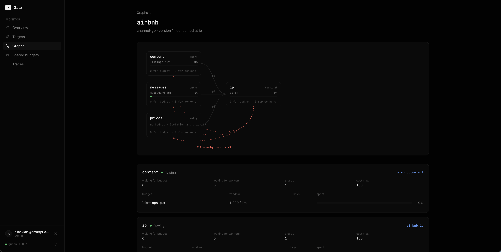

<div align="center">

<picture>
  <source media="(prefers-color-scheme: dark)" srcset="ui/src/assets/brand/gate-simbolo-bianco.svg">
  
</picture>

# Gate

**An egress rate limiter for applications that must not exceed somebody else's ceiling.**

Gate paces your outgoing traffic against limits you declare. Its defining abstraction is a
**graph**, because a vendor rarely gives you one number: it gives you a per-endpoint rate, a
per-account rate, a per-listing rate, and a ceiling on the egress IP that counts all of them at
once. The interesting question is not how to count. It is how those limits **compose**.

[Design](DESIGN_GATE_V2.md) · [Deploy](helm/gate/README.md) · Apache-2.0 · v0.2.1

<a href="assets/dashboard.png"></a>

</div>

## Three Queen primitives, and no fourth thing

There is nothing else in the data plane.

| | |
|---|---|
| **The limiter** | `kv.incr(key, delta, { max, ttl })`. The call that would break the ceiling **does not apply and returns the current value**, so `applied` **is** the admission decision — one round trip, no CAS loop, no read-then-write race. The TTL is create-only, so the window rotates by itself. |
| **The relay** | One queen transaction: `ack(the source messages) + push(the next stage's queues)`, atomic. One source partition per claim, and every push goes to the **same-named partition** on the destination. |
| **The scheduler** | The broker's wildcard long-poll. It picks candidate partitions in randomised order under `FOR UPDATE SKIP LOCKED`, so N workers spread across partitions with no coordination — and an idle stage is a parked poll holding no database connection. |

What runs is one consumer per hop of one path. No pinned runners, no depth probes, no rotation
cursor, no meter loop, no state document. The workers come from the **budget**, not from the
partition count: a limiter never needs to drain faster than it admits, so a stage whose ceiling is
200 items a second gets one lane however many partitions the ordering is spread over.

## What you declare

**Graph** is the only object, owned by an **application** — two teams may both have something they
call `airbnb`. A **node** is a place a limit applies and holds the **budgets**: `count` per
`timeMs`, subdivided for smoothing, enforced as one kv counter. A **path** is the sequence of nodes
a message visits, and it names the consumer groups; two paths crossing one node is pub-sub. Work
enters at an **ingress** queue — one Gate owns, or **one your application already owns**, in which
case your producers push with their normal SDK and Gate can be down without blocking ingest — and
leaves at an **egress** queue your own workers pop, with their own SDK, their own ack.

```jsonc
{
  "application": "channel",
  "graph": "airbnb",
  "version": 3,
  "nodes": {
    "prices": {
      "ingress": true,                                     // a queue Gate owns
      "cost": { "path": "payload.rooms", "default": 1, "max": 50 },
      "budgets": [ { "id": "prices-1s", "count": 100, "timeMs": 1000 } ]
    },
    "photos": {
      "ingress": { "queue": "channel.airbnb.photos.in" },  // one of yours
      "budgets": [
        { "id": "photos-1m",   "count": 300, "timeMs": 60000, "subWindows": 60 },
        { "id": "per-listing", "count": 100, "timeMs": 604800000, "subWindows": 1,
          "scopeBy": "payload.listingId", "whenOp": ["photo.delete"] }
      ]
    },
    "ip": {
      "budgets": [ { "id": "ip-10s", "count": 1500, "timeMs": 10000,
                     "subWindows": 10, "sharedKey": "egress-ip" } ],
      "egress": { "queue": "channel.airbnb.out", "group": "channel-workers" }
    }
  },
  "paths": [
    { "name": "prices", "share": 1.0, "nodes": ["prices", "ip"] },
    { "name": "photos", "share": 0.5, "nodes": ["photos", "ip"] }
  ]
}
```

Read it back: `ip-10s` is ten one-second windows of 150, so a burst cannot take the whole
ten-second allowance in the first 200 ms. `per-listing` is 100 photo deletions per listing per week
— 200,000 Postgres rows with a seven-day TTL, and no Gate machinery at all. And `prices` may drive
the shared `ip` counter to its ceiling while `photos` refuses itself at half of it.

**A sub-second window cannot be expressed.** A kv TTL is whole seconds, so `timeMs` below 1000 is
enforced as `count` per second — tighter than declared, never looser. The declare warns and names
both numbers.

### Priority is capacity, not queue position

A path's `share` is a **ceiling on the node's one counter**:

```
path P's incr at node N uses  max = round(count_sub(N) × share(P))
```

so the headroom above every lower ceiling is an exact, atomic reserve, held by the row lock that
does the counting — no scheduler, no barrier, no depth probe, no leg ordering anywhere in the
codebase. Shares need not sum to 1 and normally will not; they overlap on purpose, and the total is
still bounded because there is one counter.

**What this gives up is strict priority**: a low-priority message already sitting in an interior
queue is still ahead of a high-priority one in that partition. What it buys is that the reserve is
always there — which the previous design could not deliver, because its lanes each held their own
copy of the counter and two of them both saying "you may use the ceiling" genuinely spent it twice
(93/s against a declared 50/s).

## The life of one push

```
your producer  ──►  ingress queue        (your SDK, or Gate's HTTP front door)
                        │
              stage: wildcard long-poll, batch 200, one source partition
                        │
                    kv.incr(budget key, batch cost, {max: your share, ttl: sub-window})
                        │
             applied ───┴─── refused ──► admit the PREFIX that fits, or
                │                        park in-handler, or release the claim
                ▼
        ONE transaction: ack(the batch) + push(next hop, same partition)
                        │
                        ▼
                  egress queue           ──►  your workers, your SDK, your ack
```

**A denial charges nothing.** The whole batch is charged in one call; if a counter refuses, what
applied is refunded and the prefix that fits is charged instead. Prefix, not subset: order inside a
partition is the guarantee the whole design rests on.

**Waiting is not failing.** When nothing fits, the handler parks holding its claim for as long as
it can afford to (`GATE_MAX_PARK_MS`), and returns without acking when it cannot. Queen charges no
retry budget on lease expiry, so paced work is never dead-lettered for waiting, and an explicit
failed ack is reserved for real poison — which is why Gate has a working DLQ again.

## The API

| | |
|---|---|
| `PUT \| GET \| DELETE /v1/apps/{app}/graphs/{name}` | The whole document, every time. `200` means validated, provisioned **and** stored, and the response carries the compiled plan: every queue, group, kv key and per-path ceiling. `/targets/{name}` is the same route for a one-node graph. |
| `POST .../nodes/{node}/push` | Optional front door, off where a node names a queue you own. `partition` is **yours** and passes through unchanged at every hop; `txn` is the coalescing lever. Refuses a cost above `cost.max` (422) and answers **429 with a Retry-After** at the ceiling. |
| `POST .../nodes/{node}/backoff` | The vendor said 429. Gate **spends the node's window** — the counter is written to its ceiling with a TTL of your `Retry-After` — so every path stops through the ordinary refusal path and every parked consumer's wait **is** your deadline. `DELETE` lifts it early. |
| `POST .../reenter` | The per-item half of the same thing: one item goes back to the ingress of the **first node of its own path**, so it re-pays every budget rather than skipping the ones upstream of where it failed. The attempt rides in the transaction id, so reporting one item twice collapses on the broker's dedup. Bounded by `maxAttempts`. |
| `GET .../nodes/{node}/eta?path=…` | Two backlogs, kept apart because they have different owners: `waitingForBudget` is Gate holding work back on purpose, `waitingForWorkers` is your own consumers not keeping up. A bound, never a promise. |

Consuming is your own SDK against the egress queue — Gate does not mediate the pop, hand out leases
or see the outcome. `GET .../next` and `POST /v1/leases/*` answer **410 Gone**, naming the queue.

```js
await queen.queue('channel.airbnb.out').group('channel-workers')
  .consume(async (msg) => { /* … */ })
```

**Every declare rule turns a silent runtime failure into a rejected `PUT`** that names the number,
the consequence and the fix. The rule names are API: shape (`acyclic`, `path-terminal`,
`fanout-branch`, …), budgets (`node-unscoped-budget`, `subwindow-fits`, `cost-fits`,
`shared-conflict`, `provenance`, …), shares (`share-range`, `share-order`, `share-rounds-out`) and
ownership (`ingress-owner`). Warnings are trades rather than mistakes: `window-sub-second`,
`fanout-multiplies`, `egress-owner`, `single-partition` and their kin.

A v1 document is accepted, mapped, and answered **200 with warnings naming every field that was
mapped or ignored** — `cap`/`periodSeconds` became `count`/`timeMs`, `alignment: rolling` became
`subWindows`, `lanes[]` became paths, `edges[]` became `paths`, and `maxKeys`/`shardBy`/`pacing` are
no-ops because cardinality is now rows with a TTL.

## Run it

Gate needs a QueenMQ broker (**1.0.4 or newer**) and, optionally, a PostgreSQL for history. Without
`PG_HOST` it limits exactly as well; it just cannot answer anything about yesterday.

```bash
docker run -d --name queen-pg -e POSTGRES_PASSWORD=postgres -p 5434:5432 postgres:18
docker run -d --name queen --link queen-pg -e PG_HOST=queen-pg -e PG_PASSWORD=postgres \
  -p 6632:6632 ghcr.io/queen-mq/queen:latest
docker run -d --name gate -p 8788:8788 -p 8790:8790 \
  -e QUEEN_URL=http://host.docker.internal:6632 \
  -e GATE_BIND=0.0.0.0:8788 -e GATE_PUBLIC_BIND=0.0.0.0:8790 \
  -e GATE_DEV_EMAIL=you@example.com -e GATE_ADMIN_EMAILS=you@example.com \
  ghcr.io/queen-mq/gate:latest
```

Console on <http://localhost:8790>, API on `:8788`. **Two ports, on purpose**: `GATE_BIND` is the
plane your applications call and has no authentication — the assumption is that only your network
reaches it — and `GATE_PUBLIC_BIND` requires a Google session on every route. `GATE_DEV_EMAIL` is
the local sign-in bypass and Gate refuses to boot with it set on an `https` public URL;
`GATE_ADMIN_EMAILS` is what makes that identity able to write rather than only read.

In the console, **Targets → New target** opens a four-step wizard: application and name,
incoming and outgoing queues, rate limits, and a review before creation. For a graph with several
nodes, use **Graphs → New graph**. The **Edit** page offers a guided form and the JSON editor over
the same draft; switching views keeps the limits, cost settings, shared counters and paths.

Choose **Watch traffic** to observe a target before setting limits. Select an observation period
between two minutes and 30 days. Gate still consumes the ingress and relays to the egress; your
workers consume that outgoing queue. Watch requires PostgreSQL history, enables minute roll-ups,
and applies no budgets or ingress load shedding. Limits retained in the document remain inactive.
The target page shows relayed items, average cost per second and peak cost per minute for complete
minutes within the observation period. Expiry marks it ready for review and keeps traffic in watch.
**Configure limits** opens the form with enforcement selected; enter limits and save to activate
them. Mode changes require a higher version, which the form sets automatically. Unchanged routes
retain their queue names and consumer groups. Observed traffic describes demand; it does not prove
the provider's quota or reveal bursts shorter than a minute.

The JSON equivalent adds `"watch": {"durationSeconds": 86400}` to the graph. Budgets may be empty;
the server persists `watch.startedAt` as Unix milliseconds and keeps it across declarations and
restarts. Remove `watch`, supply valid budgets and increase `version` to enforce limits. The console
reads its observation summary at `GET /api/apps/:app/graphs/:graph/watch`.

Building from source requires Node.js 24 for the embedded console; the root `.nvmrc` selects it.

```bash
nvm use                                     # Node.js 24, from the root .nvmrc
cd ui && npm ci && npm run build && cd ..   # the console is compiled into the binary
cargo build --release --workspace
cargo test --workspace                      # the live suite reports as ignored
GATE_TEST_QUEEN_URL=http://127.0.0.1:6632 cargo test --workspace -- --include-ignored
cargo run --release -p gate-e2e  -- load 50 3000 20   # did the declared ceiling hold?
cargo run --release -p gate-bench -- all              # what does Gate itself cost?
```

The live suite is ignored by default and that is the honest setting: it used to skip and **pass**
with no broker configured, which is green lines that verified nothing. CI sets
`GATE_TEST_REQUIRE_LIVE=1`, which turns a missing broker into a failure.

## Operating it

| knob | default | what it is |
|---|---|---|
| `QUEEN_URL` | `http://localhost:6632` | the broker |
| `GATE_KV_NAMESPACE` | `gate` | where the counters and the documents live |
| `GATE_STAGE_BATCH` | 200 | the per-claim batch; also the divisor on the counter's traffic |
| `GATE_LANE_CAPACITY` | 1000 | what one lane drains, items/s. `workers = clamp(ceil(cap_rate / this), 1, partitions)`, overridable with `GATE_STAGE_CONCURRENCY` |
| `GATE_LEASE_SECONDS` | 10 | a **work** lease, renewed while a handler runs |
| `GATE_POLL_TIMEOUT_SECONDS` | 30 | the parked long-poll window; paid in shutdown latency |
| `GATE_MAX_PARK_MS` | 30000 | how long a handler holds its claim waiting for a window before releasing |
| `GATE_INTERIOR_SEED_SKEW_SECONDS` | 120 | how far before a graph's start a new group on an **interior** queue is seeded; a margin for Gate's clock against the broker's, capped at 600 |
| `GATE_RECONCILE_SECONDS` | 15 | how often a replica re-reads the store |
| `GATE_MAX_PUSH_BODY_BYTES` | 8388608 | the largest body a **push** route buffers, clamped to 2 MiB–64 MiB. 2 MiB is axum's default, which is what applied to everything until 2026-09-04 because nothing set one; the ceiling is there because the limit is a per-request memory reservation and nothing bounds how many requests hold one at once. Document routes keep the default |

**Where a new consumer group starts, and it is two rules.** On an **ingress** queue — yours, or
Gate's own HTTP front door — a new group is seeded at the *head* of the retained log, because a
producer writes it and a backlog there is real work the limiter exists to pace. On an **interior**
queue, which only Gate's own relay ever writes, a new group is seeded at the *tail* as of the
moment the graph runtime started. That difference is not decoration: a frame reaches an interior
queue only because some path relayed it there and stamped its own name on it, so a group for a path
added later can never need anything that was already sitting there — and reading it would mean
acking frames whose transaction rows the broker has long since purged, which is a stage that can
never advance its cursor again. The first declare of a graph provisions those queues empty, so tail
and head are the same thing and nothing changes; a restart finds the group already there and the
broker leaves its cursor alone.

**Queue retention.** Gate-owned ingress and interior queues retain completed messages for
30 days (`completedRetentionSeconds: 2592000`, with retention enabled). Only messages older
than that threshold and passed by every consumer group are eligible for cleanup. Pending
work has no age limit (`retentionSeconds: 0`, `maxWaitTimeSeconds: 0`), so waiting for a
budget cannot expire it. Gate applies this policy when provisioning or restoring a graph.
Application-owned ingress and egress queues retain their own configuration; configure their
retention separately in Queen.

**Replicas are safe.** Declarations live in `queen.kv` and every replica reconciles against them on
that timer; counters are one row each, so N replicas spend one budget.

**The hot path writes nothing** — one kv batch and one transaction is the entire budget. Per stage
there are counters (`popped`, `admitted`, `deferred`, `parked`, `released`, `forwarded`, `commits`,
`duplicates`, `foreign`, `deadlettered`, `wedged`), and `forwarded / commits` is the number that
explains a stage's throughput. `wedged` is the one to alert on: it counts a stage whose ack the
broker keeps refusing at a claim head that never moves, which is a stuck cursor and not a budget
backlog — the stage says so once at `ERROR` with the `seek` that fixes it. Denials are kept in a bounded in-process ring; admissions are counted, never
traced. Rollups are opt-in per graph (`"counters": { "windowSeconds": 60 }`); the current storage
and API contract is a fixed one-minute window, so `60` is the only accepted value. Observability is
a thing you switch on, not a thing that runs whether or not anyone is looking.

**One thing to say out loud.** The declaration names your egress queue, and:

> Write access to an interior or egress queue is admission bypass — the same trust model as any
> queen queue. Gate paces what flows through it; it does not defend a queue from a writer who
> already has the credentials.

The `_gate` stamp on a routed payload is unsigned and unverified. It is trusted because Gate writes
it server-side, and it overwrites whatever a producer wrote on the first hop.

## When something else is the better tool

- **You do not run QueenMQ.** Gate is queen-native by requirement, not convenience: the counters are
  `queen.kv` rows, the relay is the queen transaction wire, the scheduler is the broker's long-poll.
  There is no adapter and there is not going to be one. That is the price of the design, and the
  audience is whoever already runs the broker.
- **You need strict priority**, in the sense of a high-priority item overtaking a low-priority one
  already queued. Gate reserves *capacity*, not queue position.
- **You need the vendor call to be exactly-once.** Gate paces what leaves; your workers make the
  call and Gate never sees the outcome. Re-entry is something you report, not something it detects.
- **Your limit is one number on one endpoint.** A token bucket in your own process is smaller than
  a service, and honest about it.

## Licence

Apache-2.0. See [LICENSE.md](LICENSE.md).

### Target setup and operations

**AI configuration agent.** Open **AI agent** in the top navbar or **Create with AI**
on the target list. The chat opens in a side panel over the current page, and
closing it preserves the conversation and draft while you navigate the console.
Select an application and describe a new target's queues,
limits or Watch period. The agent asks for missing details, shows assumptions,
and validates generated drafts using Gate's compiler and validation rules. It
can repair a rejected draft once. Choose **Review in editor** to inspect the form
or JSON, then explicitly create the graph. The agent cannot change running
graphs or provision queues. Queue ownership and availability are checked again
when the graph is saved.

Select the provider and model in the server environment:

| `GATE_AI_PROVIDER` | Default `GATE_AI_MODEL` | API key variables, in precedence order |
| --- | --- | --- |
| `openai` (default) | `gpt-5.6-luna` | `GATE_OPENAI_API_KEY`, `OPENAI_API_KEY` |
| `gemini` | `gemini-3.8-flash` | `GATE_GEMINI_API_KEY`, `GEMINI_API_KEY`, `GOOGLE_API_KEY` |

For Gemini 3.8 Flash, set `GATE_AI_PROVIDER=gemini` and
`GATE_AI_MODEL=gemini-3.8-flash`; for 3.6 Flash, set
`GATE_AI_MODEL=gemini-3.6-flash`. Supply the key through an ignored local
environment file or a deployment secret. Gate reads process environment
variables and does not load `.env` automatically. Never put a key in a `VITE_`
variable or commit it. Restart Gate after changes. Without a key for the selected
provider, the chat shows setup guidance and the wizard remains available.
The first nonempty key for that provider wins; there is no automatic switch to
another provider. Invalid provider names fail startup.

OpenAI uses the [Responses API with structured outputs](https://developers.openai.com/api/docs/guides/structured-outputs?api-mode=responses);
Gemini uses native [generateContent with structured outputs](https://ai.google.dev/gemini-api/docs/generate-content/structured-output).
`GATE_AI_MODEL` can select a model supporting the chosen API and JSON schema
output. Model selection is server-side; the browser never supplies a model or key.

Both providers can draft multi-node graphs with several paths, combined time
windows, scoped and operation-specific limits, shared budgets and payload-based
costs. Fan-out is available when explicitly requested and duplicates messages;
multiple paths are not operation filters. Drafts are bounded to 20 nodes and 20
paths. Gate validates structure and budget arithmetic, not whether a quota is
correct for your provider: review assumptions and routing before creation.

The shared prompt drafts complete simple requests directly and asks at most two
focused questions at a time for missing requirements. Complex requests distinguish
traffic routes, cost units, per-account/operation limits, common downstream gates,
burst behavior and capacity priorities. Refinements preserve the rest of the draft;
validation repair must ask before changing a business requirement. Four worked
examples cover a simple target, combined limits, an Airbnb-like topology and Watch.
Their quotas are fictional, not vendor defaults. Tests compile those exact examples
and check their effective budgets and routing; they do not evaluate live model quality.

The public chat endpoint requires an administrator, like other console writes.
The internal listener keeps its existing cluster-only trust boundary. Only the
conversation, selected application, Watch availability and current draft are
sent only to the selected provider; Gate does not fetch queue payloads or other
graph configurations for the agent. OpenAI requests use `store: false`; Gemini
uses individual `generateContent` calls without creating a server conversation.
Conversations and review drafts stay
in browser memory and clear on refresh or sign-out. Each request is limited to
21 alternating messages, 64 KB of conversation text, two provider calls and
150 seconds; each replica allows two concurrent requests. Provider errors are
redacted. `GET /api/ai/status` reports availability; `POST /api/ai/chat` returns
a validated draft or a clarification without saving it.

The new-target wizard offers **global**, **per account**, **per operation** and
**shared budget** templates. Amounts are editable examples marked `assumed`;
verify the actual quota before enforcing them. Scoped and operation templates
also retain a global ceiling. Shared keys join an application-wide allowance.

**Clone** opens a new graph draft with the same rules and paths. It resets the
name, version and Watch timer, gives the clone Gate-owned ingress queues and
requires new outgoing queue names. Shared budget keys are preserved and called
out for review. The **Integration guide** uses resolved queues and the configured
worker group to generate JavaScript producer/consumer and optional HTTP examples.
It opens automatically after creation and remains available on the graph page.

**Why is traffic waiting?** checks broker availability, stopped relays, repeated
cursor failures, active backoff, recent budget refusals and outgoing worker
backlog. Each finding names the next check and links to its node. Duration means
first observed on the responding replica, and resets after recovery or restart;
worker backlog alone does not prove that a worker is broken.

**Traffic over time** shows a selectable node over 15 minutes, 1, 6 or 24 hours:
relayed items, incoming estimates, relay/worker backlog and oldest pending age.
Successful configuration changes appear as timeline markers. Queue snapshots and
annotations require the existing PostgreSQL history connection; queue sampling is
opt-in through `counters` (enabled automatically in Watch and wizard templates).
Incoming estimates use changes in consumer positions for a single-path ingress;
retention or cursor changes can affect the estimate. Shared interior-queue traffic
cannot be attributed from these positions and is shown as unknown. Broker ages
are group-specific where available. Missing history and timestamps remain gaps.
Snapshots and configuration annotations are retained for 31 days. An annotation
is operational context, not a revision store or rollback mechanism.

### Simulating a Watch limit

**Try a limit** replays recorded traffic against one global allowance without
changing the graph. It uses the same effective subdivision count/window as the
limiter and reports delayed items, maximum and final backlog, and drain time if
no further traffic arrives. The first preview supports **one full-share path,
fixed item cost and a global counter exclusive to this node**. Scoped,
operation-filtered, shared and multi-path policies require additional dimensions
and are not implied by this preview.

Watch records successfully relayed item counts and cost at **one-second**
resolution, without payloads. Capture stops at the observation deadline; it does
not activate limits. Simulations cover up to the last 24 hours of that session,
start with an empty queue, and assume FIFO and simultaneous arrivals within each
second. They cannot reconstruct sub-second bursts, existing input delays or
minute-only history collected by older versions. Counts are sizing estimates,
not provider quota recommendations.

Samples flush off the relay path every ten seconds. Per-recorder replacement
writes make retries idempotent and independent replicas add their observations.
Buffers are bounded to an hour of distinct active seconds per stage; known gaps
and dropped items are reported. A crash can lose the latest unflushed samples,
and recordings only describe replicas running this build. Fine samples are
retained for 31 days. The existing minute rollups keep their 90-day retention.

Read-only endpoints, also available to console viewers:

- `GET /api/apps/{app}/graphs/{graph}/diagnostics`
- `GET /api/apps/{app}/graphs/{graph}/timeline?minutes=60`
- `GET /api/apps/{app}/graphs/{graph}/simulate?node=limit&count=100&timeMs=1000&minutes=60`

The simulation accepts optional `subWindows`; `minutes` is bounded to 1–1440.
